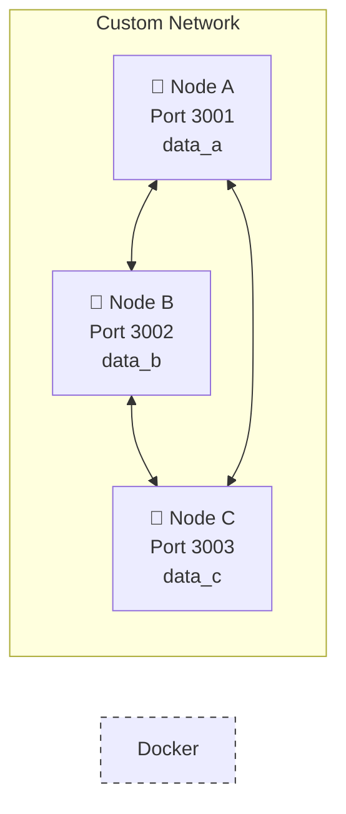
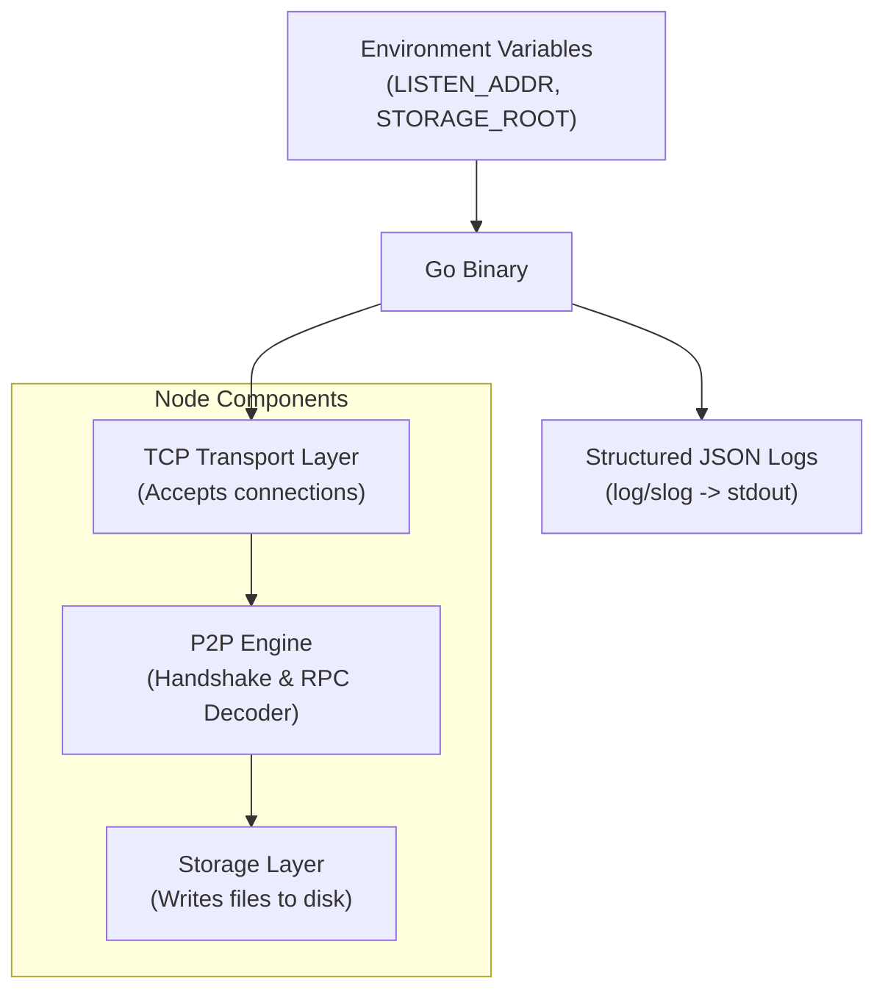

<div align="center">

# 🐝 HiveFS

### Production-Grade Distributed P2P Filesystem

*Built in Go · Containerized · Observable · Cloud-Ready*

[](https://golang.org/)
[](https://docs.docker.com/compose/)
[](LICENSE)
[](https://12factor.net/)
[]()

</div>

---

## Overview

**HiveFS** is a distributed peer-to-peer filesystem where multiple nodes communicate over raw TCP, share data, and store files independently. Similar in architecture to **IPFS**, **BitTorrent**, and **Amazon S3** — built from the ground up in Go.

This project is being progressively evolved from a working distributed core into a **fully production-instrumented system**, demonstrating the complete DevOps/SRE engineering lifecycle — from local development to cloud-scale Kubernetes orchestration.

---

## Roadmap

| # | Phase | Description | Status |
|---|-------|-------------|--------|
| 1 | **12-Factor App** | Env-var config + structured JSON logging | ✅ Complete |
| 2 | **Containerization** | Multi-stage Docker build + 3-node Compose cluster | ✅ Complete |
| 3 | **Observability** | Prometheus metrics + auto-provisioned Grafana dashboard | 🔄 In Progress |
| 4 | **CI/CD Pipeline** | GitHub Actions — lint, test, Docker build | ⏳ Planned |
| 5 | **Infrastructure as Code** | Terraform — VPC, Security Groups, EC2 on AWS | ⏳ Planned |
| 6 | **Orchestration** | Kubernetes StatefulSet + PVC + Headless Service | ⏳ Planned |

---

## Architecture

Our architecture features a decentralized P2P topology orchestrated inside a custom container network:

### 1. Cluster Network Topology


### 2. Node Internal Architecture & Data Flow


---

## Project Structure

```
hivefs/
├── 📄 main.go                    # Entry point — wires all layers together
├── 📄 storage.go                 # Disk I/O — persists incoming data to files
│
├── 📁 client/                    # Test client package
│   └── client.go                #   Sends RPC messages to a node
│
├── 📁 p2p/                       # Peer-to-peer networking layer
│   ├── transport.go              #   Interface: Transport & Peer contracts
│   ├── tcp_transport.go          #   Implementation: TCP-based transport
│   ├── encoding.go               #   Decodes raw bytes → RPC structs
│   ├── handshaker.go             #   Peer handshake logic (pluggable)
│   ├── message.go                #   RPC message type definition
│   └── tcp_transport_test.go     #   Unit tests for TCP transport
│
├── 🐳 Dockerfile                 # Multi-stage build: builder + minimal runtime
├── 🐳 docker-compose.yml         # 3-node local cluster definition
├── 📄 Makefile                   # Convenience build/run/test commands
├── 📄 go.mod                     # Go module definition
└── 📄 .gitignore                 # Excludes binaries, env files, secrets
```

---

## Quick Start

### Prerequisites

| Tool | Version | Purpose |
|------|---------|---------|
| [Go](https://golang.org/dl/) | 1.24+ | Build & run locally |
| [Docker Desktop](https://www.docker.com/products/docker-desktop/) | Latest | Run cluster |

### Option A — Single Node (Local)

```sh
# Clone
git clone https://github.com/adarshkshitij/Hivefs.git
cd Hivefs

# Run node (default: port 3001)
go run .

# In a separate terminal — send a test message
go run client/client.go
```

**Expected output:**
```json
{"time":"...","level":"INFO","msg":"starting node","listenAddr":":3001"}
{"time":"...","level":"INFO","msg":"TCP server started","addr":":3001"}
{"time":"...","level":"INFO","msg":"new peer connected","remoteAddr":{"IP":"127.0.0.1","Port":55736}}
{"time":"...","level":"INFO","msg":"message received","from":"127.0.0.1:55736","payloadLen":22}
```

### Option B — Full 3-Node Cluster (Docker)

```sh
# Spin up all 3 nodes
docker compose up --build

# Tear everything down
docker compose down -v
```

**What you get:**
- `node-a` → `localhost:3001` → `/data_a`
- `node-b` → `localhost:3002` → `/data_b`
- `node-c` → `localhost:3003` → `/data_c`

---

## Configuration

All config is via **environment variables** — zero hardcoded values (12-Factor App principle):

| Variable | Default | Description |
|----------|---------|-------------|
| `LISTEN_ADDR` | `:3001` | TCP address the node binds to |
| `STORAGE_ROOT` | `data` | Root directory for file storage |

```sh
# Custom port and storage path
LISTEN_ADDR=:4000 STORAGE_ROOT=/mnt/storage go run main.go storage.go
```

---

## Key Engineering Decisions

<details>
<summary><b>Why Go?</b></summary>

Go's goroutines and channels are purpose-built for concurrent network programming. Each peer connection runs in its own goroutine — lightweight (2KB stack), no OS thread overhead, and native channel-based message passing for the RPC pipeline.

</details>

<details>
<summary><b>Why Multi-Stage Docker Build?</b></summary>

```dockerfile
# Stage 1: Full Go toolchain (~800MB) — compile only
FROM golang:alpine AS builder

# Stage 2: Minimal Alpine (~15MB) — ship only the binary
FROM alpine:latest
```
**Result:** ~15MB production image. Smaller attack surface, faster pulls, less CVE exposure.

</details>

<details>
<summary><b>Why Structured JSON Logging?</b></summary>

In production, logs are ingested by **Loki, Elasticsearch, or Datadog**. These systems need machine-parseable JSON, not human-readable text strings.

```json
{"time":"2026-06-06T21:18:34Z","level":"INFO","msg":"new peer connected","remoteAddr":"127.0.0.1:3002"}
```
Every log entry is a queryable event — filter by level, node, message type, or any field.

</details>

<details>
<summary><b>Why Environment Variables for Config?</b></summary>

The same binary runs on dev (port 3001), staging (port 4001), and prod (port 443). Only the environment changes — the code and image stay identical. This is the core of the **12-Factor App** methodology.

</details>

---

## Testing

```sh
# Run all tests
go test ./...

# Verbose output
go test -v ./...

# Via Makefile
make test
```

---

## Observability (Phase 3 — In Progress)

Prometheus metrics to be exposed at `/metrics`:

| Metric | Type | Description |
|--------|------|-------------|
| `hivefs_active_connections` | Gauge | Live peer connections |
| `hivefs_bytes_transferred_total` | Counter | Total bytes sent over network |
| `hivefs_bytes_stored_total` | Counter | Total bytes written to disk |
| `hivefs_messages_total` | Counter | RPC messages processed |

---

## License

MIT — see [LICENSE](LICENSE)

---

<div align="center">

**Built by [Adarsh Kumar](https://github.com/adarshkshitij)**

*If you find this useful, consider giving it a ⭐*

</div>
